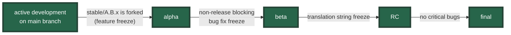
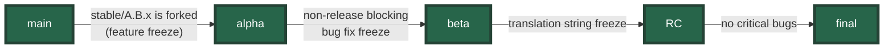
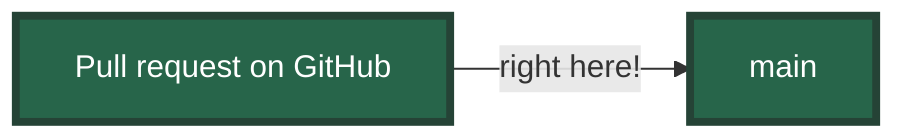

---
# You can also start simply with 'default'
theme: the-unnamed
# random image from a curated Unsplash collection by Anthony
# like them? see https://unsplash.com/collections/94734566/slidev
# background: https://cover.sli.dev
# some information about your slides (markdown enabled)
title: Run your tests against Django's main!
info: |
  ## Run your tests against Django's `main`!

  Talk given at the Django London Meetup (2025-02-13). Made with [Slidev](https://sli.dev).
# apply unocss classes to the current slide
class: text-center
# https://sli.dev/features/drawing
drawings:
  persist: false
# slide transition: https://sli.dev/guide/animations.html#slide-transitions
transition: slide-left
# enable MDC Syntax: https://sli.dev/features/mdc
mdc: true
---

# Run your tests against Django's `main`!

<div>

Django London Meetup

Thursday, 13 February 2025

</div>

---
transition: slide-left
---

# About me

- Sage Abdullah
- Developer at Torchbox
- Wagtail CMS core team member
- Google Summer of Code contributor and mentor for Wagtail and Django
- Djangonauts Space navigator

<style>
  li {
    font-size: 1.5rem;
    line-spacing: 2;
  }
</style>

<!--

Most recently I got involved in the Djangonaut Space program as a navigator
where we help onboard new contributors to Django itself and also external
packages.

-->

---
transition: slide-left
---

# Django is **stable**

https://docs.djangoproject.com/en/stable/misc/api-stability/

> _Django is committed to API stability and forwards-compatibility._

> ... _making API stability a very high priority_ ...

> _Our aim is to provide a modern, dependable web framework of the highest quality that encourages best practices in all projects that use it._

<!--
We often hear people say that Django is stable. In fact, Django itself makes a commitment to stability as stated in the documentation.
-->

---
transition: slide-left
---

# How to keep it stable?


<v-click>

Also, deprecation of public APIs are done over at least two feature releases.

</v-click>

<!--
So how do we keep it stable?
First one, the most obvious, is by having lots of tests. There are almost 18k tests as of the upcoming 5.2 release.

The tests are run against all the officially supported database backends, all the Python versions, across different operating systems.

Also, to minimise disruption...
Django's release cadence is .0, .1, .2 LTS, and then back to .0.
So for example, a feature or setting deprecated in Django 5.1 will be removed in Django 6.0.
-->

---
transition: none
---

# Django's release process



<!--
Here is the release process for Django.

For a given version, development happens on the main branch over a period of about 8 months. Then, we fork the main branch to stable/A.B.x (e.g.), which marks the release of A.B alpha. 

During the alpha period, new features will only be merged to main, and not backported to the stable branch. Bug fixes will be backported, including ones that are not release blockers (exp.). Development of the next release happens in parallel.

After about a month, there's the beta release. From this point, only release blockers will be backported.

Another month after the beta release, comes the Release Candidate (RC) release. This marks the translation string freeze, which means no new translatable strings should be added to the branch.

If there are no critical bugs, after a couple of weeks the final release is out.
-->

---
transition: none
---

# Django's release process


<!--
Here's an example for 5.0 and 5.1.

5.0 alpha was released in September 2023, and then it follows the process described earlier.
Around 8 months later 5.1 alpha was released in May 2024. A month afterwards it's 5.1 beta in June, another month for 5.1 RC in July, and then 5.1 a couple weeks after in August.

As I said, when an alpha release comes out, which marks the feature freeze, the work for the next release 5.1 happens in parallel. So the gap between 5.0 final and 5.1 alpha is actually only like 5 and a half months
-->

---
transition: slide-left
---

# Django's release process



When is the best time to catch bugs?

<v-clicks>



<div class="flex gap-2 w-full justify-center items-center mt-4">
  
  <div class="text-4xl"> = 😵‍💫</div>
</div>

</v-clicks>

<!--
So, going back to the release process.

When is the best time to catch bugs? Any suggestions?

main?

Well, ideally, bugs should be caught before they even get to main. Anybody can review PRs in Django.

But it's hard to keep up with all the incoming PRs unless you're a Django Fellow, in which case it's literally your job.
-->

---
transition: slide-left
---

# How you can help

Run your tests against Django's `main` branch!

```yml
test:
  runs-on: ubuntu-latest
  continue-on-error: ${{ matrix.experimental }}
  strategy:
    matrix:
      include:
        - python: '3.13'
          django: 'git+https://github.com/django/django.git@main#egg=Django'
          experimental: true
  steps:
    - uses: actions/checkout@v4
    - uses: actions/setup-python@v5
      with:
        python-version: ${{ matrix.python }}
    - run: pip install -r requirements.txt
    - if: ${{ matrix.experimental }}
      run: pip install "${{ matrix.django }}"
    - run: python -Wd manage.py test
```

<!--
So here's what you can do instead:
Run your tests against Django's `main` branch!

It's pretty straightforward. For example, to run this in your CI, here I have an example for GitHub Actions.

You can add another job to your test matrix, and then do a pip install with the format for git repos, so pip install git+...

And then run your tests as usual.

If you maintain a Django package, you probably do this already, with different Django versions. But make sure you also test against the `main` branch, not just the final release versions.
-->

---
transition: slide-left
layout: center
---

# How does that help? 🤔

<!--
But how does that help?
-->

---
transition: none
---

# How does that help? 🤔


<!--
Well, sometimes, things do break!

Whether intentionally or not. For example, in Wagtail we also test against Django's main branch, as well as the stable/ branches.

Just a few hours ago, our tests broke when you run it with Django's latest `main` branch.

There's an import error, saying that the `SubqueryConstraint` cannot be imported from `django.db.models.sql.where`.
-->

---
transition: none
---

# How does that help? 🤔


<!--
And sure enough!

Earlier today, the `SubqueryConstraint` class has been removed from Django. This is an internal class, it's undocumented, so in this case Django did not go through the deprecation process.

In this case, the class was removed because it was more like a workaround for using subqueries in an `in` lookup. Since the workaround is no longer needed, they removed it.

Side note: I'm glad that I didn't write these slides until today, because this literally just happened. Otherwise I'd have to dig through past examples. So, procrastination pays off sometimes.
-->

---
transition: slide-left
---

# How does that help **you**? 🤔


<v-click>

(...or, why you shouldn't use Django's internal APIs)

</v-click>

<!--
So how does that help **you**?

The good thing about running our tests against Django's main branch is that it makes it easy to find which commit caused the issue and what you should about it.

In this case, Wagtail doesn't really use the class, it only inspects it to give a more meaningful error message when you use a subquery, which is unsupported in this case.

So I guess it's also a lesson on why you shouldn't use Django's internal APIs. If you do, sometimes for good reasons, make sure to run your tests against Django's main branch.
-->

---
transition: none
---

# How does that help **Django**?


<!--
And how does this help Django?

Well, in some cases, your tests might fail because it's a legitimate bug or regression in Django that their tests don't cover.

If you're not familiar, this is Django's issue tracker called Trac, on code.djangoproject.com.
-->

---
transition: none
---

# How does that help **Django**?


<!--
For example, last month, just two days before Django 5.2 alpha release was out, Wagtail caught a bug in Django.

The bug was that if you use multi-table inheritance for your models, and you call the full_clean() method on an instance of the child model, it executes a database query when it shouldn't.

This was a regression caused by the implementation of the composite primary keys in the upcoming Django 5.2. I submitted a ticket to Django, along with a test case that demonstrates the issue.
-->

---
transition: slide-left
---

# How does that help **Django**?


<!--
And the issue was promptly fixed the same day (or the following day, I forgot).

And wouldn't it be nice to have your name credited in the commit message?
-->

---
transition: slide-left
layout: center
---

# Run your test against Django's `main`...

<v-click>

...and report any issues you find!

</v-click>

<!--
So!

Run your tests against Django's `main` branch

**and**

report any issues you find!
-->

---
transition: slide-left
layout: cover
---

# Thank you!

https://slides.laymonage.com/tests-django-main

<!--
That's it from me, thank you!
-->
