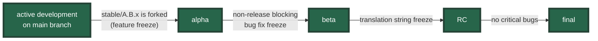
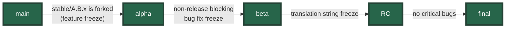
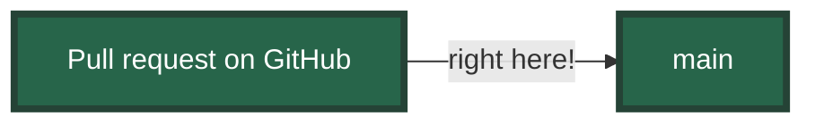

---
# You can also start simply with 'default'
theme: the-unnamed
# random image from a curated Unsplash collection by Anthony
# like them? see https://unsplash.com/collections/94734566/slidev
# background: https://cover.sli.dev
# some information about your slides (markdown enabled)
title: Run your tests against Django's main!
info: |
  ## Run your tests against Django's `main`!

  Talk given at the Django London Meetup (2025-02-13). Made with [Slidev](https://sli.dev).
# apply unocss classes to the current slide
class: text-center
# https://sli.dev/features/drawing
drawings:
  persist: false
# slide transition: https://sli.dev/guide/animations.html#slide-transitions
transition: slide-left
# enable MDC Syntax: https://sli.dev/features/mdc
mdc: true
---

# Run your tests against Django's `main`!

<div>

Django London Meetup

Thursday, 13 February 2025

</div>

<!--
The last comment block of each slide will be treated as slide notes. It will be visible and editable in Presenter Mode along with the slide. [Read more in the docs](https://sli.dev/guide/syntax.html#notes)
-->

---
transition: slide-left
---

# About me

- Sage Abdullah
- Developer at Torchbox
- Wagtail CMS core team member
- Google Summer of Code contributor and mentor for Wagtail and Django
- Djangonauts Space navigator

<style>
  li {
    font-size: 1.5rem;
    line-spacing: 2;
  }
</style>

---
transition: slide-left
---

# Django is **stable**

https://docs.djangoproject.com/en/stable/misc/api-stability/

> _Django is committed to API stability and forwards-compatibility._

> ... _making API stability a very high priority_ ...

> _Our aim is to provide a modern, dependable web framework of the highest quality that encourages best practices in all projects that use it._

---
transition: slide-left
---

# How to keep it stable?


<v-click>

Also, deprecation of public APIs are done over at least two feature releases.

</v-click>

---
transition: none
---

# Django's release process



---
transition: none
---

# Django's release process


---
transition: slide-left
---

# Django's release process



When is the best time to catch bugs?

<v-clicks>



<div class="flex gap-2 w-full justify-center items-center mt-4">
  
  <div class="text-4xl"> = 😵‍💫</div>
</div>

</v-clicks>

---
transition: slide-left
---

# How you can help

Run your tests against Django's `main` branch!

```yml
test:
  runs-on: ubuntu-latest
  continue-on-error: ${{ matrix.experimental }}
  strategy:
    matrix:
      include:
        - python: '3.13'
          django: 'git+https://github.com/django/django.git@main#egg=Django'
          experimental: true
  steps:
    - uses: actions/checkout@v4
    - uses: actions/setup-python@v5
      with:
        python-version: ${{ matrix.python }}
    - run: pip install -r requirements.txt
    - if: ${{ matrix.experimental }}
      run: pip install "${{ matrix.django }}"
    - run: python -Wd manage.py test
```

---
transition: slide-left
layout: center
---

# How does that help? 🤔

---
transition: none
---

# How does that help? 🤔


---
transition: none
---

# How does that help? 🤔


---
transition: slide-left
---

# How does that help **you**? 🤔


<v-click>

(...or, why you shouldn't use Django's internal APIs)

</v-click>

---
transition: none
---

# How does that help **Django**?


---
transition: none
---

# How does that help **Django**?


---
transition: slide-left
---

# How does that help **Django**?


---
transition: slide-left
layout: center
---

# Run your test against Django's `main`...

<v-click>

...and report any issues you find!

</v-click>

---
transition: slide-left
layout: cover
---

# Thank you!

https://slides.laymonage.com/tests-django-main
